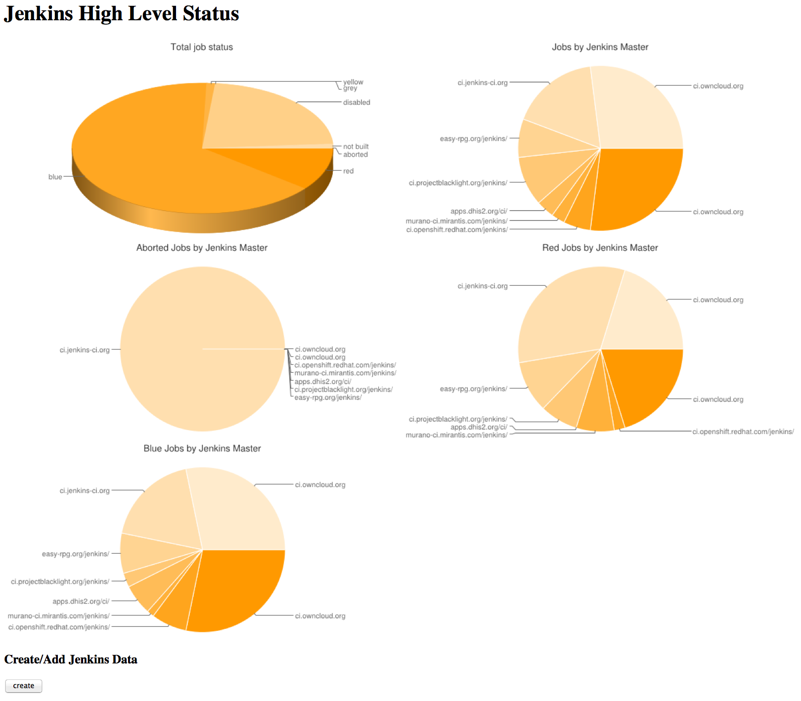
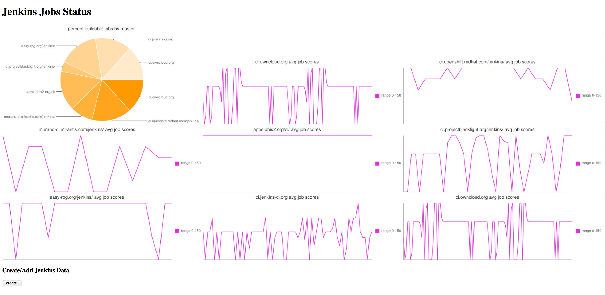

# devops-dashboard
One stop shop for status of all your DevOps tools

# Start up dev environment
recommending rbenv, install using [this](https://www.digitalocean.com/community/tutorials/how-to-install-ruby-on-rails-with-rbenv-on-ubuntu-18-04) link.

OS & Service requirements:

* Ubuntu 18.04

```bash
sudo apt-get install mysql-server mysql-client libmysqlclient-dev
```

```bash
rbenv install 2.6.6
rbenv global 2.6.6
gem install bundler
bundle install
```

## Mysql quickstart
```bash
mysqladmin create ddash
sudo su -
mysql
CREATE USER 'ddash'@'localhost' IDENTIFIED BY ‘ddash';
grant all privileges on dev.* to 'ddash'@'localhost';
flush privileges;
```

### Associated Rails quickstart
`rake db:schema:load`

after the initial load, then use this command for further schema changes
`rake db:migrate`

## Bootstrapping the server
`bundle exec rails server`

you should now see the following (or similar)

```bash
[2020-08-17 13:06:40] INFO  WEBrick 1.4.2
[2020-08-17 13:06:40] INFO  ruby 2.6.6 (2020-03-31) [x86_64-linux]
[2020-08-17 13:06:40] INFO  WEBrick::HTTPServer#start: pid=1153094 port=3000
```

If you press the create button and have a proper list of Jenkins endpoints you will see something like this:



## Looking in mysql

```bash
mysql
use dev.ddash
show tables

+----------------------+
| Tables_in_dev.ddash  |
+----------------------+
| ar_internal_metadata |
| jenkins_hellos       |
| jenkins_jobs         |
| schema_migrations    |
+----------------------+

select * from jenkins_hellos;

describe jenkins_hellos;

+------------+--------------+------+-----+---------+----------------+
| Field      | Type         | Null | Key | Default | Extra          |
+------------+--------------+------+-----+---------+----------------+
| id         | int(11)      | NO   | PRI | NULL    | auto_increment |
| name       | varchar(255) | YES  |     | NULL    |                |
| url        | varchar(255) | YES  |     | NULL    |                |
| color      | varchar(255) | YES  |     | NULL    |                |
| created_at | datetime     | YES  |     | NULL    |                |
| master     | varchar(255) | YES  |     | NULL    |                |
+------------+--------------+------+-----+---------+----------------+

```

## General Todo

[x] Use some of the Jenkins API REST call examples in ../docs/sample_rest_calls.md

[x] Remove present useless jobs data in jenkins_jobs. Display the useful graphs on the
page on jenkins_hellos

[ ] Find a way to access the list of jenkins job names in JenkinsJobs

[ ] create graphs which list the top five best performing jobs and lowest 5 disappointing jobs

[ ] JenkinsJobsObjects need to get stored somewhere so we can simply look there to generate the job details report.

[ ] There needs to be a method that simply iterates through all the Jenkins Masters. Put it in JenkinsMasters

[ ] Perhaps persisting the data via serialized object will be better than using mocks. Use this to test when there iis no connectivity

## Redis, Resque and Rails plans

[ ] Used [this doc](http://jimneath.org/2011/03/24/using-redis-with-ruby-on-rails.html#installing_redis) to set up redis & resque

[ ] More inspiration for [redis and resque](http://tutorials.jumpstartlab.com/topics/performance/background_jobs.html)

[ ] Useful for [mac users](http://naleid.com/blog/2011/03/05/running-redis-as-a-user-daemon-on-osx-with-launchd)

[ ] order of operation for resque:

* mysqlstart
* redisstart
* rails server

[ ] When the whole thing is running you can look over your resque status by going to [this](http://localhost:3000/resque/) URL

[ ] you can add the sleep job by running this command
`bundle exec rake environment resque:work QUEUE=sleep`

## Author
radkin@github.com (not a proper email address)
